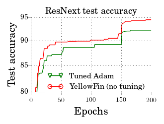
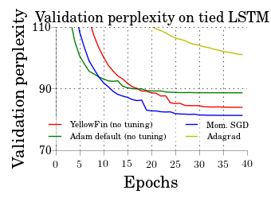

# YellowFin

YellowFin is an auto-tuning optimizer based on momentum SGD **which requires no manual specification of learning rate and momentum**. It measures the objective landscape on-the-fly and tunes momentum as well as learning rate using local quadratic approximation.

The implementation here can be **a drop-in replacement for any optimizer in PyTorch**. It supports ```step``` and ```zero_grad``` functions like any PyTorch optimizer after ```from yellowfin import YFOptimizer```. We also provide interface to manually control the learning rate for fine-tuning.

For more technical details, please refer to our paper [YellowFin and the Art of Momentum Tuning](https://arxiv.org/abs/1706.03471).

For more usage details, please refer to the inline documentation of ```tuner_utils/yellowfin.py```. Example usage can be found here for [ResNext on CIFAR10](https://github.com/JianGoForIt/YellowFin_Pytorch/blob/master/pytorch-cifar/main.py#L91) and [Tied LSTM on PTB](https://github.com/JianGoForIt/YellowFin_Pytorch/blob/master/word_language_model/main.py#L191).

## Updates
**[2017.07.03] Fixed a gradient clipping bug. Please pull our latest master branch to make gradient clipping great again in YellowFin.**

**[2017.07.28] Added logrithmic smoothing to improve stableness against ocassional exploding gradient.**

## Setup instructions for experiments
Please clone the master branch and follow the instructions to run YellowFin on [ResNext](https://arxiv.org/abs/1611.05431) for CIFAR10 and [tied LSTM](https://arxiv.org/pdf/1611.01462.pdf) on Penn Treebank for language modeling. The models are adapted from [ResNext repo](https://github.com/kuangliu/pytorch-cifar) and [PyTorch example tied LSTM repo](https://github.com/pytorch/examples/tree/master/word_language_model) respectively. Thanks to the researchers for developing the models. **For more experiments on more convolutional and recurrent neural networks, please refer to our [Tensorflow implementation](https://github.com/JianGoForIt/YellowFin) of YellowFin**.

Note YellowFin is tested with PyTorch v0.1.12 for compatibility. It is tested under Python 2.7.

### Run CIFAR10 ResNext experiments
The experiments on 110 layer ResNet with CIFAR10 and 164 layer ResNet with CIFAR100 can be launched using
```
cd pytorch-cifar
python main.py --lr=1.0 --mu=0.0 --logdir=path_to_logs --opt_method=YF
```

### Run Penn Treebank tied LSTM experiments
The experiments on multiple-layer LSTM on Penn Treebank can be launched using
```
cd word_language_model
python main.py --emsize 650 --nhid 650 --dropout 0.5 --epochs 40 --tied --opt_method=YF --logdir=path_to_logs --cuda
```

## Detailed guidelines
* YFOptimizer(parameter_list lr=1.0, mu=0.0) sets initial learnig rate and momentum to 1.0 and 0.0 respectively. This is the uniform setting (i.e. without tuning) for all our PyTorch and Tensorflow experiments. Typically, after a few thousand minibatches, the influence of these initial values diminishes. 

  * If the loss explodes after a very small number of iterations, you may want to lower the init lr to prevent the explosion at the beginining. 
  
  * We also have users reporting to use regularizer to avoid explosions.

* If you want to more finely control the learning rate (say using a manually set constant learning rate), or you want to use the typical lr-dropping technique after a ceritain number of epochs, please use ```set_lr_factor()``` in the YFOptimizer class. E.g. if you want to use a manually set constant learning rate, you can run ```set_lr_factor(desired_lr / self._lr)``` before ```self.step()``` at each iteration. More details can be found [here](https://github.com/JianGoForIt/YellowFin_Pytorch/blob/master/tuner_utils/yellowfin.py#L22). 

* The default setting will not do gradient clipping to prevent gradient explosion. There are three cases regarding gradient clipping. We recommend first turning off gradient clipping and only turning it on when necessary. 

  * If you want to manually set threshold to clip the gradient, you can consider using the ```clip_thresh=thresh_on_the_gradient_norm``` argument when initializing the YFOptimizer.
  
  * If you want to totally turn off gradient clipping, please use ```clip_thresh=None, auto_clip_fac=None``` when initializing the YFOptimizer.
  
  * If you want to keep the auto clipping feature, you can also play with ```auto_clip_fac=positive_value``` where lower value means stricter clipping and the value 1.1 or 2 work well on a few examples we tried out.
  
* When using log probability style losses, please make sure the loss is properly normalized. In some RNN/LSTM cases, the cross_entropy need to be averaged by the number of samples in a minibatch. Sometimes, it also needs to be averaged over the number of classes and the sequence length of each sample in some PyTorch loss functions. E.g. in nn.MultiLabelSoftMarginLoss, ```size_average=True``` needs to be set.

## Additional experiments to test the repo
We use the [ResNext on CIFAR10](https://github.com/JianGoForIt/YellowFin_Pytorch/blob/master/pytorch-cifar/main.py#L91) and [Tied LSTM on PTB](https://github.com/JianGoForIt/YellowFin_Pytorch/blob/master/word_language_model/main.py#L191) to test the PyTorch implementation here. For more on experimental results, please refer to our [paper](https://arxiv.org/abs/1706.03471).






## Implementation for other platforms
For Tensorflow users, we implemented [YellowFin Tensorflow Repo](https://github.com/JianGoForIt/YellowFin).

<!---For MXNet users, Github user [StargazerZhu](https://github.com/StargazerZhu) has already implemented a Theano version here: [YellowFin MXNet Repo](https://github.com/StargazerZhu/YellowFin_MXNet).--->

For Theano users, Github user [botev](https://github.com/botev) has already implemented a Theano version here: [YellowFin Theano Repo](https://gist.github.com/botev/f8b32c00eafee222e47393f7f0747666).

We thank the contributors for YellowFin in different deep learning frameworks.
